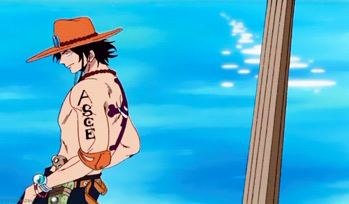

<!--
**WeriksonAlves/WeriksonAlves** is a ✨ _special_ ✨ repository because its `README.md` (this file) appears on your GitHub profile.

Here are some ideas to get you started:

- 🔭 I’m currently working on ...
- 🌱 I’m currently learning ...
- 👯 I’m looking to collaborate on ...
- 🤔 I’m looking for help with ...
- 💬 Ask me about ...
- 📫 How to reach me: ...
- 😄 Pronouns: ...
- ⚡ Fun fact: ...
-->

 

<!-- https://stackoverflow.com/questions/1838873/visualizing-branch-topology-in-git/34467298#34467298 -->

### Hello, welcome, my name is Werikson Frederiko 👋

:cactus: I am a dedicated graduate student in Computer Science at UFV. My academic journey began with an undergraduate degree in Electrical Engineering at the same institution, where I delved into various fields of robotics, refining my expertise in computer vision and machine learning techniques. Taking advantage of techniques such as KNN and Principal Component Analysis, using programming languages such as MatLab and Python. Currently, I am immersed in innovative research at the Robotics Specialization Center - NERo, where my focus is predominantly in the field of image pattern recognition.

TOTAL PROGRAMMING TIME SINCE JULY 2020:
<!--

-->
- 🔭 I am currently working on:
 
  - Robotics Research  [NERo-UFV](https://github.com/neroUFV);
  - Gesture Recognition for Robotics
  
- 🌱 I'm currently learning:

  - Machine Learning techniques;
  - Data Science (specific applications in Robotics)
  - .

- 👯 I want to collaborate in:

  - Computer Vision processes
  - Pattern recognition processes
  - Robotic Automation Processes
  

- 🤔 I'm looking for help with:

  - Machine Learning techniques;

- 📫 Como chegar até mim:

 
 🚀

## My Skills
- Pattern recognition
- Computer Vision
- Machine Learning
- Human-Robot Interaction
- Control and Automation
- 

 
  
  

## Languages and Tools:

  <a href="https://github.com/WeriksonAlves">
   
  
  

 
- Thank you for your visit. 🤖
